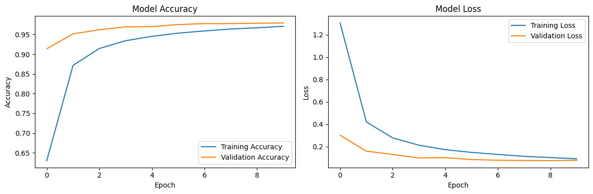
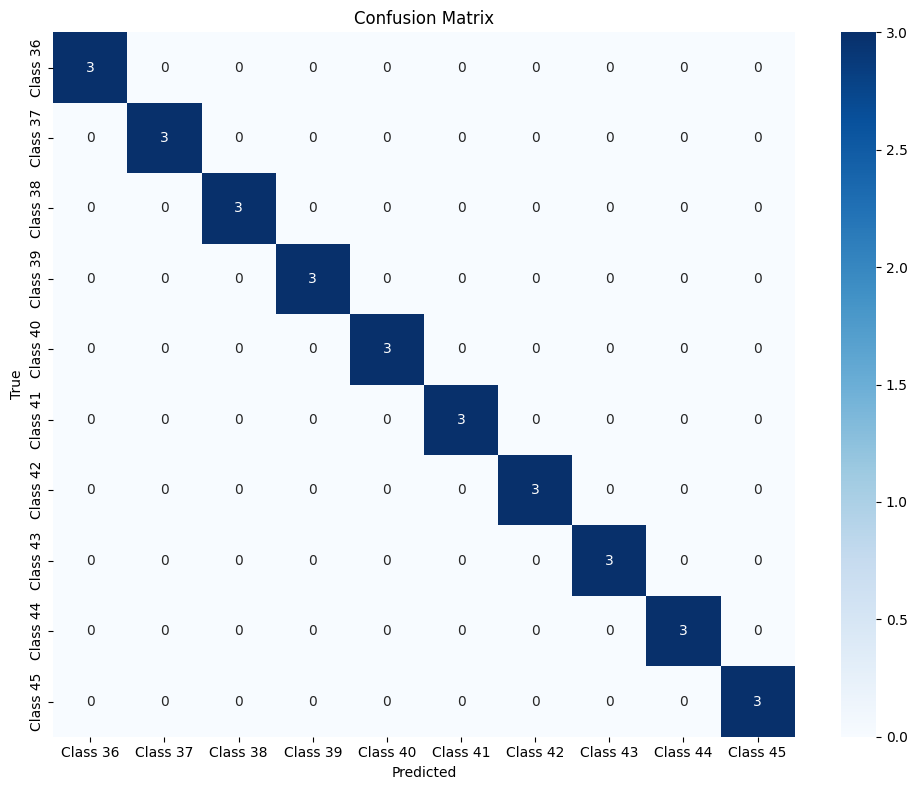
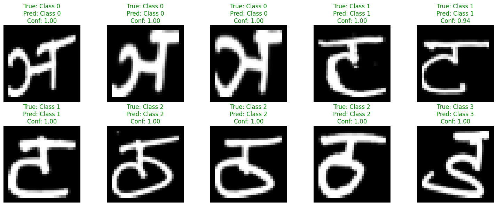

# Devanagari Handwritten Character Recognition - Training Framework
### [Live browser inference](https://dcda-v2.vercel.app/)
This project implements a convolutional neural network (CNN) for recognizing handwritten Devanagari characters and digits. The repository contains the training and evaluation code that achieves high accuracy on the test set.

## Overview

Devanagari is an abugida writing system used in India and Nepal. It is the main script for languages such as Hindi, Marathi, Nepali, and Sanskrit. This project recognizes 36 Devanagari consonants and 10 digits.

The model is trained using TensorFlow 2.15.1. The training code is structured for clarity and reusability, making it suitable for educational purposes and as a starting point for similar recognition tasks.

## Model Architecture

The CNN architecture consists of:
- 3 Convolutional blocks (each with a Conv2D layer followed by MaxPooling)
- Flattening layer
- Dense layer with dropout for regularization
- Output layer with softmax activation

The model achieves over 95% accuracy on the test set.

## Training Results

### Training and Validation Curves



### Confusion Matrix on Test Set



### Sample Test Set Predictions



## Dataset

The model is trained on the Devanagari Handwritten Character Dataset, which contains:
- 36 consonant character classes
- 10 digit classes
- Approximately 2,000 images per class
- Image size: 32x32 pixels (grayscale)

## Model Evaluation

The trained model demonstrates excellent performance on the test dataset:

### Evaluation Results:
- High accuracy across all character classes
- Minimal confusion between visually similar characters
- Robust performance on handwritten input with varied styles

## Requirements

### For Training and Testing (Python)
- TensorFlow 2.15.1
- NumPy 1.25.2
- OpenCV
- Matplotlib
- scikit-learn
- tqdm (for progress bars)

## Setup and Usage

### Training the Model

1. Download the Devanagari Handwritten Character Dataset and extract it to the project directory.

2. Install the required Python dependencies:
   ```
   pip install tensorflow==2.15.1 numpy==1.25.2 opencv-python matplotlib scikit-learn tqdm
   ```

3. Run the training script:
   ```
   python train.py
   ```

   This will:
   - Load and preprocess the training data
   - Train the CNN model
   - Generate visualizations of the training process
   - Save the trained model and metadata

### Testing the Model

1. After training, run the test script:
   ```
   python test_model.py
   ```

   This will:
   - Evaluate the model on the test dataset
   - Generate a confusion matrix
   - Visualize test predictions with correct/incorrect highlighting
   - Calculate and display per-class accuracy

## Dataset and Preprocessing

### Dataset
The Devanagari Handwritten Character Dataset contains:
- 36 consonant character classes
- 10 digit classes
- Approximately 2,000 images per class
- Original image size varies, standardized to 32x32 pixels

### Preprocessing Pipeline
The preprocessing ensures consistent input for the model:

- Read grayscale images
- Resize to 32x32 pixels
- Normalize pixel values to [0,1]
- Reshape to match CNN input requirements (32x32x1)

This standardization is crucial for model performance and allows the CNN to focus on learning the distinctive features of each character rather than adapting to different scales or formats.

## Model Architecture Details

The CNN architecture consists of:

1. **Input Layer**: 32x32x1 (grayscale images)

2. **Convolutional Blocks**:
   - Conv2D (32 filters, 3x3 kernel, ReLU activation)
   - MaxPooling (2x2)
   - Conv2D (64 filters, 3x3 kernel, ReLU activation)
   - MaxPooling (2x2)
   - Conv2D (128 filters, 3x3 kernel, ReLU activation)
   - MaxPooling (2x2)

3. **Fully Connected Layers**:
   - Flatten
   - Dense (128 neurons, ReLU activation)
   - Dropout (0.5)
   - Dense (46 neurons, softmax activation)

4. **Training Configuration**:
   - Optimizer: Adam
   - Loss: Categorical Cross-Entropy
   - Metric: Accuracy
   - Batch Size: 64
   - Epochs: 10

This architecture provides a good balance between model complexity and performance for this recognition task.

## License

WTFPL

## Acknowledgments

- Devanagari Handwritten Character Dataset [link](https://ieeexplore.ieee.org/document/7400041/)
